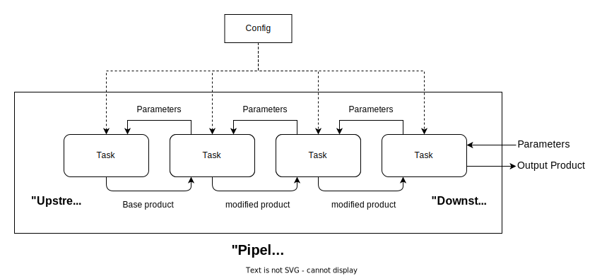
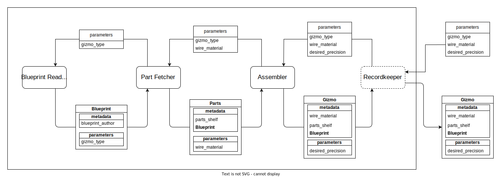

.. _pipeline_guide:

=========
Pipelines
=========
Pipelines are collections of interlocking components that can be used to reduce data, produce models, visualize data, etc. 
Pipelines are composed of :py:class:`~sika.task.Task` objects arranged such that the type constraints of each task are met. Critically, there is no 'Pipeline' class - each task object is also a standalone pipeline that can be executed (provided that it is configured properly) to produce a :py:class:`~sika.product.Product`, which are the representations of data and models in sika.

.. note::
    Effectively using sika requires a basic understanding of how `class inheritance <https://en.wikipedia.org/wiki/Inheritance_(object-oriented_programming)#Inheritance_vs_subtyping>`__ works in python. `This guide <https://realpython.com/inheritance-composition-python/>`__ provides a more-than-sufficient introduction.

Overview
========
The individual componenents of a sika pipeline are all subclassed from :py:class:`Task <sika.task.Task>`. The process of using sika is one of writing and chaining together Tasks into a pipeline, and then (optionally), hooking that pipeline up to a sika :py:class:`~sika.modeling.sampler.Sampler`. 
We'll call the first task to produce a product the most '**downstream**' one, and the task that actually produces the final product the most '**upstream**' one. No task is aware of the state, composition, or even existence of the whole pipeline. At most, a task is only dimly aware of the task immediately preceding (upstream from) it. 
To run the pipeline, we pass parameters to the last task, which, somewhere in its product-creation process, calls the preceding task, which calls the preceding task, and so on.
Because each task is ignorant of virtually every other task, they must be designed to be **independent** and **modular**. To learn about global configuration each Task has access to a :py:class:`~sika.config.Config` object. 

Example: Gizmo Factory
======================
Consider the following simple pipeline for making gizmos. In it, a Blueprint Reader task reads a Blueprint and passes it to a Part Fetcher, which finds the required Parts before passing them to an Assembler. The Assembler produces the Gizmo in its final form, but it is passed to a Recordkeeper that logs the creation of the gizmo before returning it without modification.

Products
-----------
The first task, the blueprint reader, takes the ``gizmo_type`` as a parameter and retrieves a ``Blueprint`` product for it. This task does not rely on or interface with any previous task, so it should be first in any pipeline that it's a part of. To implement this, we would start by making a ``Blueprint`` class: ::

    from sika import Provider, Product
    from dataclasses import dataclass

    @dataclass(kw_only=True)
    class Blueprint(Product):
        schema: str
    
.. important::
    The Product class extends the python ``dataclass`` for convenience. To ensure that products work correctly, every subclass of Product should be given the decorator ``@dataclass(kw_only=True)``. 

Providers
---------
Most tasks in a pipeline are :py:class:`~sika.provider.Provider` objects, which take zero or more parameters as a dictionary and return a :py:class:`~sika.product.Product` or collection of products. Our blueprint reader will be a provider of ``Blueprint``. We denote this quite intuitively: ::

    class BlueprintReader(Provider[Blueprint]):
        ...

First, we'll define what parameters the task will expect - in this case, a string called ``gizmo_name`` - by implementing the :py:attr:`~sika.provider.Provider.provided_parameters` property: ::

        @property
        def provided_parameters(self):
            return {"gizmo_name": []}
    
The empty list ``[]`` that we return in the dictionary indicates that there are no restrictions placed on what values the ``gizmo_name`` argument can hold. 

Next, we'll implement the actual functionality of the ``BlueprintReader``. To do this, our task needs to know where in our workshop we've stored our blueprints. We don't want to hardcode this information into the class (so that others could re-use our gizmo pipeline in their own workshops) but it doesn't change often enough to make sense as a parameter. This is the perfect piece of information to store in our **configuration**. 

All of the logistics of setup and configuration management are handled by the :py:class:`~sika.provider.Provider` and :py:class:`~sika.provider.Task` classes. Our ``BlueprintReader`` inherits that functionality and we get to take it for granted (this is also why we haven't defined an ``__init__`` method). We'll query our :py:class:`~sika.config.Config`, which is found at ``self.config``, for the location of the blueprint store. We'll decide that we expect to find this in our config under the key ``blueprint_location``. It's the responsibility of the caller of this task to have identified the necessary configuration keys and ensured that they're in the config.  

Then, we'll load the schematic text and package it into a ``Blueprint``. We do all of this by implementing our task's ``_call`` method, which will be called when this task is invoked (more on that later): ::

    def _call(self,parameters) -> Blueprint:
        gizmo_name = parameters["gizmo_name"]
        blueprint_loc = self.config['blueprint_location']

        schema, author = read_blueprint(gizmo_name,blueprint_loc)  # fictional function
        
        return Blueprint(
                    schema=schema,
                    parameters=parameters,  #  we don't have to store these, but it can be useful
                    metadata={"blueprint_author":author}  # tack on extra information
                )
    
That's it for our ``BlueprintReader`` class - let's test it. 

Running a Pipeline
------------------
First, we'll write a quick config file, putting the following into ``workshop_config.toml``:

.. code-block::
    :caption: workshop_config.toml
    
    blueprint_location="in my most secure vault"

Then, in the main part of our program: ::

    from sika.config import Config

    config = Config("workshop_config.toml")
    reader = BlueprintReader(config=config)

    reader({"gizmo_name":"archimedian screw"})
    >>> Blueprint(parameters={'gizmo_name': 'archimedian screw'}, metadata={'blueprint_author': 'Archimedes'}, schema='...')

That was pretty simple, and it was made even easier by the fact that our ``BlueprintReader`` didn't rely on any upstream tasks. Let's implement a task that relies on a previous one - our workshop's PartFetcher.

Intermediate Tasks
------------------
We'll start with a ``Parts`` product: ::

    @dataclass(kw_only=True)
    class Parts(Product):
        frame: str
        n_screws: int
        wire: str
        paint: str

In order to know what parts it needs to fetch, the PartFetcher task will always need to be provided a ``Blueprint``. This makes it an **'intermediate task'** - it can't be the first task in a pipeline because it needs to be preceded by a specific kind of task (in this case one that provides a ``Blueprint``). We denote this in the class signature: :: 

    class BlueprintReader(Provider[Parts], IntermediateTask[Provider[Blueprint]]):
        . . .

By instantiating the class this way, we're saying two things:

    - ``Provider[Parts]``: this task will provide a product of type ``Parts``.
    - ``IntermediateTask[Provider[Blueprint]]``: this task expects to be provided a ``Blueprint``.

We only stock silver, copper, and steel wire in our workshop, so we'll note that in our :py:attr:`~sika.provider.Provider.provided_parameters` property: ::

    @property
    def provided_parameters(self):
        return {
                "wire_material": ["silver","copper","steel"],
            }

If a task has a preceding task, it will be accessible through its ``prev`` attribute. We can call the blueprint provider by calling ``self.prev`` and passing in the parameters we recieved (it will ignore the ``wire_material`` parameter unless it needs it): ::
    
        def _call(self, parameters) -> Parts:
            wire_material = parameters["wire_material"]

            blueprint = self.prev(parameters)  # call the previous task

            materials_list = parse_schema(blueprint.schema)
            parts_shelf, (frame, n_screws, wire, paint) = get_materials(materials_list, wire_material=wire_material)

            return Parts(
                frame=frame, n_screws=n_screws, wire=wire, paint=paint,
                metadata={"blueprint":blueprint, "parts_shelf": parts_shelf},
                parameters={"wire_material":wire_material}
            )

Let's put this together into a mini pipeline in the body of our program: ::

    from sika.config import Config

    config = Config("workshop_config.toml")
    
    reader = BlueprintReader()
    fetcher = PartFetcher(prev=reader)
    fetcher.configure(config=config, logger=None) 

    fetcher({"gizmo_name":"archimedian screw","wire_material":"silver"})
    >>> Parts(frame='wood', n_screws=4, wire='silver', paint='matte',
                parameters={'wire_material': 'silver'}, 
                metadata={'parts_shelf': '2C','blueprint': Blueprint( . . . )} 
            )

By passing ``reader`` into the constructor of ``fetcher``, we establish that our blueprint reader precedes our part fetcher in the pipeline, just like in the diagram.

.. hint:: 
    Calling our task's :py:meth:`~sika.task.Task.configure` method is equivalent to passing our configuration into the task during construction, like we did when we initialized our ``BlueprintReader`` in the previous example. The config is automatically propagated to upstream tasks (regardless of whether we pass it in the constructor or call :py:meth:`~sika.task.Task.configure` explicitly), which is why we didn't have to explicitly provide ``reader`` with a config.

It's important to remember that any ``Provider[Blueprint]`` would work in place of ``BlueprintReader``. In another workshop the following would work: ::

    class DivineInspiration(Provider[Blueprint]):
        . . .

    inspiration = DivineInspiration()
    fetcher = PartFetcher(prev=inspiration)

The ``PartFetcher`` class does not care what task precedes it as long as it provides a ``Blueprint``.

We'll skip the implementation of the ``Gizmo`` and ``Assembler`` classes as it would closely resemble what we've covered here so far. Instead, let's look at the Recordkeeper.

Middleware
----------
Unlike the other tasks we've written, the input and output types of the Recordkeeper are the same - it takes in a ``Gizmo`` and spits out a ``Gizmo``. This is called **middleware**. An example of a very useful piece of middleware is the :py:class:`~sika.implementations.general.FileCache`, which facilitates effortless caching and loading of file-writable products to prevent needless re-computation. From the perspective of other tasks, middleware layers are transparent - a structurally valid pipeline will remain structurally valid if we remove all middleware from it. The best way to accomplish this is to subclass :py:class:`~sika.provider.ProviderMiddleware`, which we can do like this: ::
    
    from sika import ProviderMiddleware
    
    class Recordkeeper(ProviderMiddleware[Gizmo]):
        . . . 

The implementation of middleware looks different than other tasks. We can implement the following two methods:
    
    -  :py:meth:`~sika.provider.ProviderMiddleware.parameter_middleware`: allows us to intercept, inspect, and modify the parameters coming from downstream before they're seen by upstream tasks
    -  :py:meth:`~sika.provider.ProviderMiddleware.product_middleware`: allows us to intercept, inspect, and modify the :py:class:`Products <sika.product.Product>` coming from upstream before they're seen by downstream tasks

In our case, we'll ignore the ``parameter_middleware`` method and just use the ``product_middleware`` method to write out some information about the Gizmos as they're made.

.. important::
    The preferred way for a task to write output to the console (like ``print`` does) is to use its built-in :py:meth:`~sika.task.Task.write_out` method, which will automatically use a ``logger`` object if one has been configured, and ``print`` if one has not. Consistently using :py:meth:`~sika.task.Task.write_out` makes tasks easier to reuse.

Our resulting class is very short: ::

    class Recordkeeper(ProviderMiddleware[Gizmo]):

        def product_middleware(self, prod)
            self.write_out("Just made a Gizmo! Here it is:", prod)
            return prod  # very important!

Beautiful. Let's put it all together: ::

    from sika.config import Config

    config = Config("workshop_config.toml")
    
    factory = Recordkeeper(Assembler(PartFetcher(BlueprintReader())))

    factory.configure(config=config, logger=None) 

    factory({"gizmo_name":"archimedian screw","wire_material":"silver","desired_precision":"artisan"})
    >>> 'Just made a Gizmo! Here it is: Gizmo( . . . )'

:ref:`Pipeline API <pipelines>`
===============================
View the API documentation for pipeline components